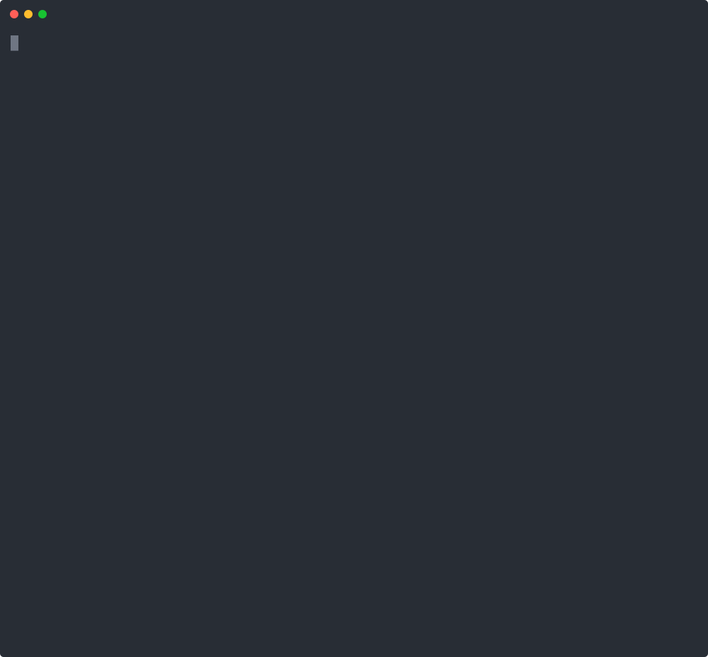

# @octabits-io/flow

[](https://github.com/octabits-io/flow/actions/workflows/ci.yml)
[](https://www.npmjs.com/package/@octabits-io/flow)
[](./LICENSE)
[](https://www.npmjs.com/package/@octabits-io/flow)

**Durable workflows for TypeScript that run on the Postgres you already have.**

Declare a DAG of Zod-typed steps. The engine runs each step as soon as its dependencies
complete, persists every transition, retries failures, and resumes after a crash. There is
no workflow server to operate, no control plane, and no vendor — it's a library you import,
not a platform you adopt.

```ts
const wf = buildWorkflow({
  type: 'publish-article',
  inputSchema: z.object({ draftId: z.string() }),
  steps: { fetchDraft, summarize, translate, publish },
});
```

`summarize` and `translate` both depend on `fetchDraft`, and `publish` waits for both — so the
engine runs the middle pair **concurrently** and fans back in, without you scheduling anything:

```
              ┌── summarize ──┐
 fetchDraft ──┤               ├── publish
              └── translate ──┘
```

That shape isn't inferred from a trace — it *is* the workflow. The DAG is a plain value you can
walk before anything runs:

```ts
for (const s of wf.definition.steps) {
  console.log(`${s.key.padEnd(12)} type=${s.type.padEnd(10)} deps: ${s.dependencies?.join(', ') || '—'}`);
}
```

```text
fetchDraft   type=fetch      deps: —
summarize    type=summarize  deps: fetchDraft
translate    type=translate  deps: fetchDraft
publish      type=publish    deps: summarize, translate
```

This is the core design choice. Flow is **declarative**, where Temporal, Inngest, Trigger.dev
and DBOS are **imperative**: there you write a function, and the graph exists only as the trace
of what it did. Both models are durable — they trade off differently, and
[the tradeoff is spelled out below](#how-it-compares).

---

## Watch it run

A fuller pipeline than the snippet above — dynamic fan-out over two `map` steps at once, a
concurrency cap so only 2 of 6 images encode at a time, a flaky step retried, a sub-workflow,
a step suspended on an external event, and a durable sleep. Then a second workflow fails and
its completed steps roll back in reverse.

<p align="center">
  
</p>

Every line is an engine transition emitted through the [`FlowObserver`](#observability) seam —
the same one you'd point at OpenTelemetry or an events table — not a `console.log` in a handler.

```bash
npx tsx scripts/demo.ts    # reproduce it
```

---

## Contents

- [Watch it run](#watch-it-run)
- [How it compares](#how-it-compares)
- [When not to use Flow](#when-not-to-use-flow)
- [Features](#features)
- [Installation](#installation)
- [Package layout](#package-layout)
- [Quick start (in-memory)](#quick-start-in-memory)
- [Core concepts](#core-concepts)
- [Defining steps](#defining-steps)
- [Running in production (Postgres + pg-boss)](#running-in-production-postgres--pg-boss)
- [Feature guide](#feature-guide)
- [Observability](#observability)
- [The AI add-on](#the-ai-add-on)
- [Extending: stores, dispatchers, gates](#extending-stores-dispatchers-gates)
- [Examples](#examples)
- [API reference](#api-reference)
- [Testing](#testing)

---

## How it compares

All of these give you durable execution. They differ in **what you operate** and **how the
workflow is expressed**.

| | **Flow** | **Temporal** | **Inngest** | **Trigger.dev** | **BullMQ** |
|---|---|---|---|---|---|
| **Infra you run** | Postgres | a cluster (frontend, history, matching, worker) + a DB | none — engine is hosted | Postgres + Redis (+ ClickHouse recommended at volume) | Redis |
| **Self-host** | it's a library | yes, MIT | no — engine and dashboard are Inngest-hosted | yes, Apache-2.0 | it's a library |
| **Model** | declarative — a static DAG value | imperative workflow code | imperative step functions | imperative tasks | job queue; flows are **trees** |
| **Fan-in / diamond deps** | yes | yes | yes | yes | no — a job can't be shared by two branches |
| **Inspect before running** | yes — the DAG is a value | no — the graph is the execution trace | no | no | yes — the flow tree is data |
| **Web dashboard** | **none** — build one on `toPublicWorkflow()` | yes | yes | yes | via third-party UIs |
| **Languages** | TypeScript | polyglot SDKs | TS, Python, Go, Kotlin | TS | Node (+ ports) |
| **Maturity** | **pre-1.0** | mature | mature | mature | mature, widely deployed |

The honest summary: **Flow is the smallest thing that is still a real workflow engine.** If
you already run Postgres, it adds no infrastructure — the queue ([pg-boss](https://github.com/timgit/pg-boss))
is Postgres too. You give up the dashboards, the polyglot SDKs, and the operational maturity
that the others have earned.

## When not to use Flow

Reach for something else if:

- **Your control flow is genuinely dynamic.** A declarative DAG is fixed at definition time.
  Flow softens this with [`defineMapStep`](#dynamic-fan-out--map) (runtime-sized fan-out),
  [sub-workflows](#sub-workflows), and [`waitForEvent`](#signals--waitforevent) — but if your
  process is "loop until a human approves, branching on whatever they typed," an imperative
  durable function will express it more naturally.
- **You want a UI out of the box.** Flow ships a wire-safe projection
  ([`toPublicWorkflow`](#serving-workflows-over-http-public-view)) and lifecycle events, not a
  dashboard. You build it.
- **You need non-TypeScript workers.** The DAG and its schemas are TypeScript values.
- **You can't run Postgres**, or you need throughput past what a Postgres-backed queue gives you.
- **You need a support contract**, or an API frozen by a 1.0 promise. This is pre-1.0 and 0.x
  minors can break.

Flow fits best when the work is a **known pipeline** — ingest → enrich → summarize → publish —
that must survive crashes, retry sanely, and stay legible to the next person who reads it.

---

## Features

| | Capability |
|---|---|
| 🧩 | **Typed DAG** — Zod-validated input/output per step; dependency outputs are typed |
| ⚡ | **Auto-parallelism** — dependency-free steps run concurrently; a step starts when all its deps complete |
| 🔁 | **Retry & timeout** — per-step `maxAttempts`, fixed/exponential backoff, wall-clock timeout |
| 💤 | **Durable sleep** — hold a step in the queue for N ms (survives restarts) |
| 🚦 | **Concurrency & rate limiting** — per-step-type caps and token buckets via a pluggable gate |
| ⏰ | **Cron / scheduled starts** — fire workflows on a schedule (pg-boss) |
| 🔑 | **Start idempotency** — a dedup key collapses double-clicks / overlapping ticks |
| 🗺️ | **Dynamic fan-out / map** — spawn one child step per item of a runtime-sized list |
| ⏸️ | **Signals / waitForEvent** — suspend a step until an external event (`resumeStep`) |
| 🪆 | **Sub-workflows** — a step starts a child workflow and awaits its result |
| ↩️ | **Saga compensation** — run rollback handlers in reverse order on failure |
| 🔭 | **Observability** — lifecycle events (run history) + per-step spans, both pluggable |
| 🤖 | **AI add-on** — instrumented models, token/cost capture, quota, daily rollups |
| 🧱 | **Pluggable everything** — `WorkflowStore`, `Dispatcher`, `StepGate`, `FlowObserver`, hooks |

---

## Installation

```bash
pnpm add @octabits-io/flow zod
```

`zod` is a **required** peer. The heavy dependencies are **optional peers** — install only
what the layers you import need:

```bash
# Postgres store / gate / event sink
pnpm add pg

# pg-boss dispatcher, workers, cron scheduler
pnpm add pg-boss

# the AI add-on
pnpm add ai @ai-sdk/provider
```

> Pure in-memory usage (great for tests and single-process apps) needs **nothing** beyond
> `zod` — the engine, `defineStep`/`buildWorkflow`, and the in-memory store are all in the core.

---

## Package layout

Each layer is a separate subpath export, so importing one never drags in another's heavy deps:

| Import | Layer | Heavy deps |
|---|---|---|
| `@octabits-io/flow` | **core** — engine, `defineStep`/`buildWorkflow`, store/dispatcher/gate interfaces, in-memory store, observability | none |
| `@octabits-io/flow/store-pg` | **store-pg** — `WorkflowStore` + `StepGate` + event sink over Postgres, with DDL | `pg` |
| `@octabits-io/flow/dispatcher-pgboss` | **dispatcher-pgboss** — `Dispatcher` + step/DLQ workers + cron scheduler over pg-boss | `pg-boss` |
| `@octabits-io/flow/ai` | **ai** — instrumented model, cost, quota, `defineAiStep`, hooks factory | `ai`, `@ai-sdk/provider` |

Enforced dependency tree (`scripts/check-boundaries.mjs`, part of `lint`):

```
core               → (nothing internal)        forbid: ai, @ai-sdk, pg, pg-boss
ai                 → core                       forbid: pg, pg-boss
store-pg           → core                       forbid: ai, @ai-sdk, pg-boss
dispatcher-pgboss  → core                       forbid: ai, @ai-sdk, pg
```

---

## Quick start (in-memory)

A complete, runnable single-process workflow — no database, no queue. The engine self-advances
through a `Dispatcher`; in-memory you supply a tiny in-process queue and drain it.

```ts
import { z } from 'zod';
import {
  createWorkflowEngine,
  createStepHandlerRegistry,
  createInMemoryWorkflowStore,
  defineStep,
  buildWorkflow,
  type Dispatcher,
  type DispatchStepPayload,
} from '@octabits-io/flow';

// 1. Define typed steps. A step's `dependencies` make its deps' outputs available as `ctx.deps`.
const inputSchema = z.object({ name: z.string() });

const greet = defineStep({
  type: 'greet',
  workflowInputSchema: inputSchema,
  outputSchema: z.object({ greeting: z.string() }),
  handler: async (ctx) => ({ greeting: `Hello, ${ctx.workflowInput.name}` }),
});

const shout = defineStep({
  type: 'shout',
  workflowInputSchema: inputSchema,
  outputSchema: z.object({ loud: z.string() }),
  dependencies: { greet },
  handler: async (ctx) => ({ loud: ctx.deps.greet.greeting.toUpperCase() + '!' }),
});

// 2. Build the workflow (a DAG derived from the steps' dependency metadata).
const wf = buildWorkflow({ type: 'hello', inputSchema, steps: { greet, shout } });

// 3. Wire the runtime: store + registry + an in-process dispatcher you drain yourself.
const store = createInMemoryWorkflowStore();
const registry = createStepHandlerRegistry();
const queue: DispatchStepPayload[] = [];
const dispatcher: Dispatcher = {
  async enqueueStep(payload) {
    queue.push(payload);
    return { ok: true, value: undefined };
  },
};
const engine = createWorkflowEngine({ store, registry, dispatcher, partitionKey: 'default' });
wf.register(registry);

// 4. Start and drain. (A real dispatcher like pg-boss does this for you across processes.)
const started = await wf.start(engine, { name: 'Ada' });
if (!started.ok) throw new Error(started.error.message);

while (queue.length) {
  const job = queue.shift()!;
  await engine.executeStep(job.workflowId, job.stepId);
}

// 5. Read the result.
const status = await engine.getWorkflowStatus(started.value.workflowId);
if (status.ok) console.log(status.value.status, status.value.output);
// → 'completed' { greet: { greeting: 'Hello, Ada' }, shout: { loud: 'HELLO, ADA!' } }
```

See [`examples/01-in-memory-quickstart.ts`](./examples/01-in-memory-quickstart.ts).

---

## Core concepts

- **Step** — a unit of work with a Zod `workflowInputSchema`, an `outputSchema`, optional
  `dependencies`, and a `handler`. Created with `defineStep` (or the variants below).
- **Workflow** — a named DAG of steps. `buildWorkflow({ type, inputSchema, steps })` derives the
  dependency graph and validates at build time that every dependency key references a real step.
- **Registry** — maps a step's `type` string to its handler + policy. `wf.register(registry)`
  populates it; the engine looks handlers up by type at run time.
- **Store** (`WorkflowStore`) — persistence for workflow + step rows. `createInMemoryWorkflowStore()`
  for tests/single-process; `createPgWorkflowStore()` for production.
- **Dispatcher** (`Dispatcher`) — enqueues a step to run. The engine calls it to schedule ready
  steps (and retries/sleeps via `startAfterSeconds`). In-process array for tests;
  `createPgBossDispatcher()` for a durable queue.
- **Engine** — `createWorkflowEngine({ store, dispatcher, registry, partitionKey, ... })`. Orchestrates
  readiness, parallelism, retries, failure cascade, and crash recovery. Bound to one **partition**.
- **Partition** — a tenancy boundary (`partitionKey`, e.g. a tenant id) stamped on every row and
  job. One engine instance serves one partition.
- **`Result<T, E>`** — every fallible call returns `{ ok: true, value }` or `{ ok: false, error }`;
  expected failures are values, not exceptions.

The engine is **self-advancing**: starting a workflow enqueues its dependency-free roots; as each
step completes the engine enqueues newly-ready steps — so parallelism and fan-in happen
automatically. A failed step (after retries) **cascades**: still-pending dependents are skipped and
the workflow ends `failed`.

---

## Defining steps

| Helper | Use it for |
|---|---|
| `defineStep({ type, workflowInputSchema, outputSchema, dependencies?, handler, retry?, timeoutMs?, delayMs?, compensate? })` | a normal step |
| `defineSleepStep({ type, sleepMs, dependencies? })` | a durable no-op delay |
| `defineWaitStep({ type, outputSchema, dependencies? })` | suspend until `engine.resumeStep` |
| `defineMapStep({ type, workflowInputSchema, itemOutputSchema, items, each, dependencies?, itemRetry?, itemTimeoutMs? })` | runtime-sized fan-out |
| `defineSubWorkflowStep({ type, workflowInputSchema, childWorkflow, input, outputSchema?, dependencies? })` | start + await a child workflow |
| `defineAiStep({ ... })` | a step whose `ctx.context` is an instrumented `AiContext` (AI add-on) |

A handler receives a **typed context**: `ctx.workflowInput` (validated), `ctx.deps`
(each dependency's validated output), `ctx.stepInput`, `ctx.context` (host value from the
`buildStepContext` hook), `ctx.signal` (abort), plus ids. It returns the step's output object
(validated against `outputSchema`). Throw, or return a retryable error, to fail the step.

---

## Running in production (Postgres + pg-boss)

The durable setup swaps the in-memory store for Postgres and the in-process queue for pg-boss.
**One-time:** apply the DDL. **Per process:** build the engine, start a step worker (drives
`executeStep`), a DLQ worker (handles exhausted jobs), and optionally a cron scheduler.

```ts
import { Pool } from 'pg';
import PgBoss from 'pg-boss';
import {
  createWorkflowEngine,
  createStepHandlerRegistry,
} from '@octabits-io/flow';
import {
  createPgWorkflowStore,
  createPgStepGate,
  createPgEventSink,
  applySchema,
  FLOW_STORE_DDL,
  FLOW_GATE_DDL,
  FLOW_EVENT_DDL,
} from '@octabits-io/flow/store-pg';
import {
  createPgBossDispatcher,
  createPgBossStepWorker,
  createPgBossDlqWorker,
} from '@octabits-io/flow/dispatcher-pgboss';

const partitionKey = 'tenant-42';
const queueName = 'flow-steps';

const pool = new Pool({ connectionString: process.env.DATABASE_URL });
const boss = new PgBoss({ connectionString: process.env.DATABASE_URL });
await boss.start();

// One-time schema setup (idempotent CREATE TABLE IF NOT EXISTS …).
// `applySchema` is a dev/test convenience — in production, paste the DDL into your
// own migration system instead so schema changes stay reviewed and versioned.
await applySchema(pool, FLOW_STORE_DDL);
await applySchema(pool, FLOW_GATE_DDL);
await applySchema(pool, FLOW_EVENT_DDL);

// Recommended for shared databases: keep the flow tables in their own Postgres
// schema, and grant access on it only to the worker's role. That isolates the
// engine's state from app tables without any row-level-security choreography.
//   await applySchema(pool, flowStoreDdl('flow'));           // emits CREATE SCHEMA IF NOT EXISTS
//   await applySchema(pool, flowGateDdl({ schema: 'flow' }));
//   await applySchema(pool, flowEventDdl('flow'));
//   … then pass `schema: 'flow'` to createPgWorkflowStore / createPgStepGate / createPgEventSink.

// Per-partition engine.
const store = createPgWorkflowStore({ pool, partitionKey });
const dispatcher = createPgBossDispatcher({ boss, queueName, partitionKey });
const gate = createPgStepGate({ pool, partitionKey, concurrency: { 'ai:generate': { maxConcurrent: 3 } } });
const observer = createPgEventSink({ pool, partitionKey }); // run history → flow_step_event
const registry = createStepHandlerRegistry();
const engine = createWorkflowEngine({ store, dispatcher, registry, partitionKey, gate, observer });

myWorkflow.register(registry);

// Step worker: pull a job, run it. Throwing triggers a pg-boss retry; exhaustion → DLQ.
const worker = createPgBossStepWorker({ boss, queueName });
await worker.start(async (payload) => {
  await engine.executeStep(payload.workflowId, payload.stepId);
});

// DLQ worker: a job that exhausted retries — mark the step terminally failed.
const dlq = createPgBossDlqWorker({ boss, queueName });
await dlq.start(async (payload) => {
  await engine.handleStepExhausted(payload.workflowId, payload.stepId, 'retries exhausted');
});

// Start work — the dispatcher enqueues, the worker drives it. No manual drain.
await myWorkflow.start(engine, { /* input */ });
```

Multi-tenant: build **one engine + store + dispatcher per partition**, all sharing the same
pool/boss. The step worker reads `payload.partitionKey` and routes to that partition's engine.

See [`examples/12-postgres-pgboss-production.ts`](./examples/12-postgres-pgboss-production.ts).

### Cron / scheduled starts

```ts
import { createPgBossScheduler, createPgBossStartWorker } from '@octabits-io/flow/dispatcher-pgboss';

const scheduler = createPgBossScheduler({ boss, queueName: 'flow-starts', partitionKey });
await scheduler.schedule({ key: 'nightly', cron: '0 3 * * *', workflowType: 'enrichment', input: { full: true } });

// A start worker turns each cron tick into a workflow start (host maps type → definition).
const starter = createPgBossStartWorker({ boss, queueName: 'flow-starts' });
await starter.start(async (payload) => {
  const wf = workflowsByType[payload.workflowType];
  await engine.startWorkflow(wf.definition, payload.input ?? {}, { idempotencyKey: payload.idempotencyKey });
});
```

---

## Feature guide

Each links to a focused, runnable example.

### Retry & timeout
```ts
const flaky = defineStep({
  type: 'call-api', workflowInputSchema, outputSchema,
  retry: { maxAttempts: 4, backoff: 'exponential', initialDelayMs: 500, maxDelayMs: 30_000 },
  timeoutMs: 10_000, // aborts + retries on expiry
  handler: async (ctx) => { /* throw a retryable error to retry within budget */ },
});
```
A failure is retried (with backoff via the dispatcher's `startAfterSeconds`) up to `maxAttempts`;
after that the step fails terminally. → [`examples/03-retry-timeout.ts`](./examples/03-retry-timeout.ts)

**Which failures count as retryable** is decided in this order:

1. **An explicit marker on the error** — always wins.
   ```ts
   import { retryableError, nonRetryableError, markRetryable } from '@octabits-io/flow';

   throw retryableError('encoder busy');              // retry, whatever the message says
   throw nonRetryableError('timeout must be > 0');    // never retry — a bug, not a blip
   throw markRetryable(await client.readError(), true); // tag an error you didn't construct
   ```
   A marker is found **through `cause`**, so wrapping doesn't lose it:
   `new Error('upstream failed', { cause: retryableError('busy') })` still retries.
2. **The step's own predicate**, for classifying a whole family of errors at once:
   ```ts
   isRetryable: (e) => e instanceof HttpError && e.status >= 500,
   ```
   (`defineMapStep` takes `itemIsRetryable` for its per-item children.)
3. **`isRetryableError`** — the zero-config default. It reads **structured fields first**:
   `code` (`ECONNRESET`, `ECONNREFUSED`, `ETIMEDOUT`, `EAI_AGAIN`, …) and HTTP status from
   `status` / `statusCode` / `response.status` (408, 425, 429 and 5xx except 501/505). Only
   then does it fall back to matching the **message** against a small vocabulary
   (`rate limit`, `timeout`, `fetch failed`, `service unavailable`, …).

That last fallback is a convenience, not a classifier — it can only judge wording. A genuine
bug reading `'timeout must be > 0'` looks transient to it. When the answer matters, mark the
error rather than phrasing it to suit the heuristic.

To stop guessing entirely, give the engine a `defaultRetryable`:

```ts
createWorkflowEngine({ …, config: { defaultRetryable: false } }); // strict: never guess
```

It replaces the classifier's answer **only where the classifier guessed**. Explicitly marked
errors, steps with their own `isRetryable`, and engine-generated failures like a step timeout
are unaffected.

### Durable sleep
```ts
const cooldown = defineSleepStep({ type: 'cooldown', sleepMs: 60 * 60 * 1000, dependencies: { charge } });
```
A no-op step held in the queue for `sleepMs` once ready — durable across restarts (the delay lives
in the queue, not in memory). → [`examples/04-durable-sleep.ts`](./examples/04-durable-sleep.ts)

### Concurrency & rate limiting
```ts
const gate = createInMemoryStepGate({
  concurrency: { 'ai:generate': { maxConcurrent: 2 } },
  rateLimit: { 'ai:generate': { perSecond: 5, burst: 10 } },
});
const engine = createWorkflowEngine({ store, dispatcher, registry, partitionKey, gate });
```
A gated step is admitted or deferred (re-enqueued) **without consuming a retry attempt**. Use
`createPgStepGate` for cross-process caps (crash-safe leases + a token bucket in Postgres).
→ [`examples/05-concurrency-rate-limit.ts`](./examples/05-concurrency-rate-limit.ts)

### Start idempotency
```ts
await wf.start(engine, input, { idempotencyKey: `import:${fileId}` });
// a second start with the same key returns the existing workflow instead of duplicating it
```
→ [`examples/06-start-idempotency.ts`](./examples/06-start-idempotency.ts)

### Dynamic fan-out / map
```ts
const resizeAll = defineMapStep({
  type: 'resize-all',
  workflowInputSchema,
  itemOutputSchema: z.object({ url: z.string() }),
  dependencies: { listImages },
  items: (ctx) => ctx.deps.listImages.urls,          // runtime-sized list
  each: async (url, info) => ({ url: await resize(url, info.index) }),
});
// downstream reads resizeAll.items: { url: string }[]
```
The engine spawns one child step per item (own retry/gate), suspends the parent as `mapping`, and
completes it with the aggregated outputs. A failed item fails the whole map.
→ [`examples/07-dynamic-map.ts`](./examples/07-dynamic-map.ts)

### Signals / waitForEvent
```ts
const approval = defineWaitStep({ type: 'await-approval', outputSchema: z.object({ approved: z.boolean() }), dependencies: { draft } });
// …elsewhere, when the webhook/human responds:
await engine.resumeStep(workflowId, 'approval', { approved: true });
```
The step suspends (`waiting`) until `resumeStep` delivers the event payload, which becomes its
output. Idempotent — a re-delivered event is a no-op.
→ [`examples/08-wait-for-event.ts`](./examples/08-wait-for-event.ts)

### Sub-workflows
```ts
const enrich = defineSubWorkflowStep({
  type: 'enrich', workflowInputSchema,
  childWorkflow: enrichmentWorkflow,                 // a built workflow
  input: (ctx) => ({ listingId: ctx.workflowInput.id }),
  outputSchema: z.object({ /* child's output shape */ }),
});
```
Starts the child workflow (same partition), suspends the parent step, and resumes it with the
child's output when it terminates. A failed/cancelled child fails the parent step.
→ [`examples/09-sub-workflows.ts`](./examples/09-sub-workflows.ts)

### Saga compensation
```ts
const reserve = defineStep({
  type: 'reserve', workflowInputSchema, outputSchema: z.object({ ticketId: z.string() }),
  handler: async () => ({ ticketId: await reserveSeat() }),
  compensate: async (ctx) => { await releaseSeat(ctx.output.ticketId); }, // undo on later failure
});
```
On workflow failure the engine runs each completed step's `compensate` in **reverse dependency
order** (`compensating` → `compensated`). Best-effort: a throwing rollback is logged + surfaced,
the rest still run. → [`examples/10-saga-compensation.ts`](./examples/10-saga-compensation.ts)

---

## Observability

Two pluggable surfaces, both no-op by default.

```ts
import { createRecordingObserver, createRecordingTracer } from '@octabits-io/flow';

const observer = createRecordingObserver(); // captures FlowEvents in memory (tests/introspection)
const tracer = createRecordingTracer();     // captures spans in memory
const engine = createWorkflowEngine({ store, dispatcher, registry, partitionKey, observer, tracer });
```

- **`FlowObserver`** receives a `FlowEvent` at every transition — `workflow.started/completed/
  failed/cancelled` and `step.started/completed/failed/retrying/skipped/waiting/resumed/mapping/
  compensating/compensated`, each with `{ workflowId, stepKey, stepType, attempt, durationMs,
  error, partitionKey, at }`. One surface powers **run history** (persist the events) and **metrics**
  (feed OTel counters/histograms).
- **`FlowTracer`** wraps each step execution in a `flow.step` span (records the error on failure).
  An OpenTelemetry adapter is a ~10-line `startSpan` shim.
- **Postgres run history**: `createPgEventSink({ pool, partitionKey })` is a `FlowObserver` that
  appends to `flow_step_event`; read a run's timeline back with `readFlowEvents(pool, { workflowId,
  partitionKey })`. A step that retried/transitioned is fully reconstructable after the fact.

→ [`examples/11-observability.ts`](./examples/11-observability.ts)

---

## The AI add-on

`@octabits-io/flow/ai` wires model instrumentation, token/cost capture, quota, and daily usage
rollups into the engine's lifecycle hooks — the core stays AI-free.

```ts
import { createWorkflowEngine, createStepHandlerRegistry, createInMemoryWorkflowStore } from '@octabits-io/flow';
import { defineAiStep, buildAiWorkflow, createAiWorkflowHooks } from '@octabits-io/flow/ai';

const summarize = defineAiStep({
  type: 'summarize',
  workflowInputSchema: z.object({ text: z.string() }),
  outputSchema: z.object({ summary: z.string() }),
  retry: { maxAttempts: 3 }, // provider 429s
  handler: async (ctx) => {
    const { text } = await generateText({ model: ctx.context.model, prompt: `Summarize: ${ctx.workflowInput.text}` });
    return { summary: text };
  },
});

const hooks = createAiWorkflowHooks({
  modelResolver: { resolveModel: () => myModel },                 // your LanguageModelV4
  usageRecorder: { recordStepUsage: async () => {}, incrementWorkflowUsage: async () => {} },
  // quotaPolicy: { checkQuota: async () => ({ ok: true, value: undefined }) },
});

const engine = createWorkflowEngine({ store, dispatcher, registry, partitionKey: 'tenant-1', hooks });
```

`ctx.context.model` is an **instrumented** model — token usage is captured automatically and the
`onAfterStep` hook turns it into cost via a pluggable pricing table (`createCostEstimator`).
`ctx.context.host` is whatever your `resolveHost` returns (a DI scope, domain services).
→ [`examples/13-ai-workflow.ts`](./examples/13-ai-workflow.ts)

### Quota enforcement & usage aggregation

Two **store-agnostic** engines complete the add-on. They own the window math, the enforcement
order, and the rollup shapes; the raw counts and aggregate reads come through narrow store seams
(`AiQuotaStore` / `AiUsageStore`) that you implement with your own SQL — flow never touches a
database (and the `ai` layer never depends on `pg`). Scoping is generic (`partitionKey`) and
`keySource` is a free-form string, so both engines stay tenancy-agnostic.

```ts
import { createAiQuotaService, createAiUsageAggregationService, DEFAULT_AI_QUOTA } from '@octabits-io/flow/ai';

// Quota: limits come from an injected getQuota(partitionKey) callback — return
// null to exempt a scope entirely (e.g. bring-your-own-key), or null on any
// single window to leave it unlimited.
const quota = createAiQuotaService({
  store,                                   // your AiQuotaStore (count reads)
  getQuota: (partitionKey) => DEFAULT_AI_QUOTA,
});
const gate = await quota.checkQuota('tenant-1');  // Result<void, AiQuotaExceededError>
// wire it into the hooks: quotaPolicy: { checkQuota: () => quota.checkQuota('tenant-1') }

// Usage aggregation: roll completed workflows (and embedding batches) into a
// daily table, then read summaries back.
const usage = createAiUsageAggregationService({ store });  // your AiUsageStore (UPSERT + aggregate reads)
await usage.recordWorkflowCompletion({ partitionKey: 'tenant-1', date, workflowType: 'gen', keySource: 'platform', usage: totals, estimatedCostMicros });
const byDay = await usage.getUsageSummary({ partitionKey: 'tenant-1', startDate, endDate });
```

`checkQuota` enforces three windows in order — **concurrent → per-day → per-month** (UTC) — and the
day/month counts include currently-running (not-yet-aggregated) workflows. `AiUsageStore` extends
`AiQuotaStore`, so one implementation backs both engines.

---

## Extending: stores, dispatchers, gates

Everything is an interface — implement your own backend without touching the engine:

- **`WorkflowStore`** — persistence (`createWorkflow`, `listSteps`, `markStep*`, `addChildSteps`, …).
  Ship one for any database. **One correctness requirement**: `markStepRunning` is the step
  *claim* — it must flip `pending` → `running` **atomically** and return whether the caller won
  (`UPDATE … WHERE id = $1 AND status = 'pending'`, then check the affected row count). A
  read-then-write lets two workers handed the same job by an at-least-once dispatcher both run
  the handler.
- **`Dispatcher`** — `enqueueStep(payload, { startAfterSeconds })`. Back it with any queue (SQS,
  BullMQ, …); honor `startAfterSeconds` for retry/sleep to work durably.
- **`StepGate`** — `acquire(req)` → admit (with a `release`) or defer. Build org-wide caps however
  you like.
- **`FlowObserver` / `FlowTracer`** — run history + spans for your telemetry stack.
- **`WorkflowHooks`** — `onBeforeStart` (guard/quota), `buildStepContext` (inject `ctx.context`),
  `onAfterStep`, `onWorkflowCompleted`.

The in-memory store and the Postgres/pg-boss adapters are reference implementations.

### Serving workflows over HTTP (public view)

flow ships no HTTP layer, but it does ship the projection every HTTP consumer
otherwise hand-writes. `getWorkflowStatus`/`listWorkflows` return the engine's
*records* — which carry fields that must not leak onto a public API
(`partitionKey`, `idempotencyKey`, sub-workflow linkage, `metadata`, retry
`attempts`) and step statuses that are engine mechanics (`waiting`, `mapping`,
`compensating`, `compensated`) rather than display states. `toPublicWorkflow`
owns that boundary, and the matching Zod schemas slot straight into a route's
`response` declaration (OpenAPI, response validation, typed clients):

```ts
import { toPublicWorkflow, PUBLIC_WORKFLOW_SCHEMA } from '@octabits-io/flow';

app.get('/workflows/:id', async ({ params }) => {
  const status = await engine.getWorkflowStatus(Number(params.id));
  if (!status.ok) throw mapError(status.error);
  return toPublicWorkflow(status.value); // no partitionKey/idempotencyKey/metadata on the wire
}, { response: { 200: PUBLIC_WORKFLOW_SCHEMA } });
```

Step statuses fold to five display states (`pending | running | completed |
failed | skipped`; suspensions read as `running`, `compensated` as `skipped`)
via the exported `STEP_DISPLAY_STATUS` map — exhaustive over `StepStatus`, so
an engine-status addition is a compile error, not a hole in your API.
Consumer-specific fields ride on top: `PUBLIC_WORKFLOW_SCHEMA.extend({...})` +
spread over `toPublicWorkflow(...)`.

---

## Examples

Runnable, focused examples live in [`examples/`](./examples) — see [`examples/README.md`](./examples/README.md).

| # | File | Shows |
|---|---|---|
| 01 | `01-in-memory-quickstart.ts` | minimal setup + run loop |
| 02 | `02-dag-parallel-fan-in.ts` | parallel branches + fan-in (diamond DAG) |
| 03 | `03-retry-timeout.ts` | per-step retry + timeout |
| 04 | `04-durable-sleep.ts` | durable delay between steps |
| 05 | `05-concurrency-rate-limit.ts` | in-memory `StepGate` |
| 06 | `06-start-idempotency.ts` | dedup key collapses duplicate starts |
| 07 | `07-dynamic-map.ts` | runtime fan-out / map |
| 08 | `08-wait-for-event.ts` | suspend + `resumeStep` |
| 09 | `09-sub-workflows.ts` | child workflow compose + await |
| 10 | `10-saga-compensation.ts` | reverse-order rollback on failure |
| 11 | `11-observability.ts` | observer events + tracer spans |
| 12 | `12-postgres-pgboss-production.ts` | full pg store + gate + event sink + pg-boss + cron |
| 13 | `13-ai-workflow.ts` | AI add-on (instrumented model + cost) |

The in-memory examples (01–11) share a small driver, [`examples/runtime.ts`](./examples/runtime.ts),
that builds an engine over the in-memory store and an in-process queue you drain.

---

## API reference

Condensed list of public exports per subpath.

**`@octabits-io/flow`** (core)
- Engine: `createWorkflowEngine`, `createStepHandlerRegistry`
- Steps: `defineStep`, `defineSleepStep`, `defineWaitStep`, `defineMapStep`, `defineSubWorkflowStep`, `buildWorkflow`
- Store: `createInMemoryWorkflowStore`, `WorkflowStore` (interface)
- Dispatch: `Dispatcher`, `DispatchStepPayload`, `EnqueueOptions` (interfaces)
- Gate: `createInMemoryStepGate`, `StepGate`, `ConcurrencyRule`, `RateRule`
- Observability: `createRecordingObserver`, `createRecordingTracer`, `noopObserver`, `noopTracer`, `FlowObserver`, `FlowTracer`, `FlowEvent`
- Hooks/types: `WorkflowHooks`, `Logger`, `Result`, `RetryPolicy`, `StepStatus`, `WorkflowStatus`, `WorkflowWithSteps`
- Public view: `toPublicWorkflow`, `toPublicStep`, `toDisplayStepStatus`, `STEP_DISPLAY_STATUS`, `PUBLIC_WORKFLOW_SCHEMA`, `PUBLIC_WORKFLOW_STEP_SCHEMA`, `WORKFLOW_STATUS_SCHEMA`, `STEP_DISPLAY_STATUS_SCHEMA`, `PublicWorkflow`, `PublicWorkflowStep`, `StepDisplayStatus`

**`@octabits-io/flow/store-pg`**
- `createPgWorkflowStore`, `applySchema`, `flowStoreDdl`, `FLOW_STORE_DDL`
- `createWorkflowStore`, `SqlExecutor`, `poolExecutor`, `toExecutor` — inject your own executor (e.g. RLS-scoped) instead of a raw `Pool`
- `createPgStepGate`, `flowGateDdl`, `FLOW_GATE_DDL`
- `createPgEventSink`, `readFlowEvents`, `flowEventDdl`, `FLOW_EVENT_DDL`

**`@octabits-io/flow/dispatcher-pgboss`**
- `createPgBossDispatcher`, `ensureStepQueue`
- `createPgBossStepWorker`, `createPgBossDlqWorker`
- `createPgBossScheduler`, `createPgBossStartWorker`, `ensureStartQueue`

**`@octabits-io/flow/ai`**
- `defineAiStep`, `buildAiWorkflow`, `createAiWorkflowHooks`
- `createInstrumentedModel`, `createUsageAccumulator`
- `createInstrumentedEmbeddingModel`, `createEmbeddingUsageAccumulator`
- `createCostEstimator`, `estimateCostMicros`, `DEFAULT_MODEL_PRICING`, `AiContext`
- `createAiQuotaService`, `DEFAULT_AI_QUOTA`, `AiQuotaStore`, `AiQuotaConfig`, `AiQuotaExceededError`
- `createAiUsageAggregationService`, `AiUsageStore`, `UsageSummaryRow`, `UsageByTypeRow`, `CurrentQuotaUsage`

---

## Testing

```bash
pnpm test:unit         # fast, no Docker (in-memory)
pnpm test:integration  # Postgres + pg-boss via testcontainers
pnpm lint              # dependency-boundary check (scripts/check-boundaries.mjs)
pnpm typecheck         # tsc --noEmit
```

Write your own workflows against `createInMemoryWorkflowStore()` + an in-process dispatcher (see
[`examples/runtime.ts`](./examples/runtime.ts)) for fast, deterministic unit tests; use
`createRecordingObserver()` to assert the lifecycle.

---

## Contributing

Bug reports with a runnable reproduction are the most useful thing you can send; PRs are
welcome. See [CONTRIBUTING.md](./CONTRIBUTING.md) for the setup, the layer rules the lint
enforces, and the correctness requirements a custom `WorkflowStore` has to meet.

---

## Status

Pre-1.0 — developed in [octabits-io/flow](https://github.com/octabits-io/flow) (extracted from the
[octabits platform monorepo](https://github.com/octabits-io/platform), where its earlier history lives).
The API is stable but may still see breaking changes in 0.x minors.
